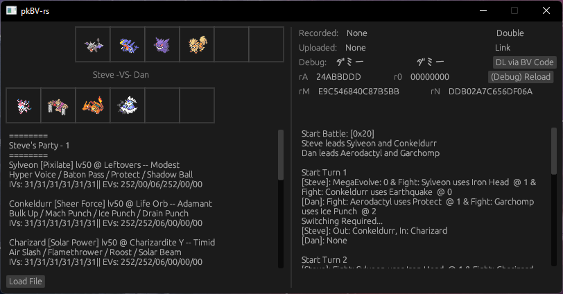

# pkBV
X/Y/OR/AS Battle Video Parser based on kwsch's [pkBV](https://github.com/kwsch/pkBV)

A rough decrypted battle video parser that gives a good overview of what happens in a video by interpreting the instruction bytecode and internal data used by the game when it repeats a battle.

Obtain decrypted battle videos via SaveDataFiler; although bvids are stored on amazon aws, you'd need authentication (which this program does not do!)

## TODO
- Better UI layout
- DL via BV Code button
- Reload button

